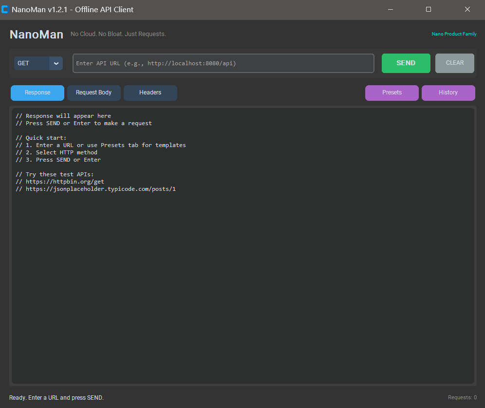

# NanoMan

**Offline API Testing Client**

NanoMan is a lightweight, privacy-focused API testing tool. No cloud, no bloat, just requests. Part of the **Nano Product Family**.




## Features

* **Offline First:** Works without internet connection for local APIs
* **Privacy Focused:** No telemetry, no cloud, your data stays local
* **Full HTTP Support:** GET, POST, PUT, PATCH, DELETE methods
* **JSON Syntax Highlighting:** Color-coded JSON responses (keys, strings, numbers)
* **Request History:** Review and load previous requests with one click
* **Threaded Requests:** UI never freezes, even on slow connections
* **Security Focused:** Strict URL validation (HTTP/HTTPS only)
* **Request Counter:** Track your session usage

## Use Cases

### Backend Development
- Test your REST APIs during development
- Verify endpoints before frontend integration
- Debug API responses with pretty-printed JSON

### Learning & Education
- Explore public APIs without installing Postman
- Perfect for coding bootcamps and tutorials
- Understand HTTP methods and responses

### API Debugging
- Quick requests without browser DevTools
- Save custom headers for authenticated endpoints
- Test local development servers

## Requirements

* Python 3.8+
* Dependencies: `customtkinter`, `requests`

## Installation

```bash
# Clone repository
git clone https://github.com/goAuD/NanoMan.git
cd NanoMan

# Install dependencies
pip install -r requirements.txt

# Run
python main.py
```

## Usage

1. Select HTTP method (GET, POST, PUT, PATCH, DELETE)
2. Enter API URL
3. (Optional) Add request body JSON in "Request Body" tab
4. (Optional) Add custom headers in "Headers" tab
5. Click **SEND** or press **Enter**

## Project Structure

```
NanoMan/
├── main.py              # Entry point
├── requirements.txt     # Dependencies
├── src/
│   ├── __init__.py
│   ├── logic.py         # Business logic (API, validation)
│   └── ui.py            # CustomTkinter UI
└── tests/
    ├── __init__.py
    └── test_logic.py    # Unit tests (9 tests)
```

## Security

| Threat | Prevention |
|--------|------------|
| XSS via URL | Only `http://` and `https://` allowed |
| JavaScript injection | `javascript:` URLs rejected |
| File access | `file://` URLs rejected |
| Request hanging | 10 second timeout |
| UI freeze | Threaded requests |

## Troubleshooting

### "Invalid or unsafe URL" error
- Make sure URL starts with `http://` or `https://`
- Check for typos in the URL
- Ensure no spaces in the URL

### Request times out
- Check if the server is running
- Try increasing timeout (edit `logic.py`, line 109)
- Verify network connection

### JSON not formatted
- Response must have `Content-Type: application/json`
- If plain text, it will display as-is

### Connection refused
- Server might not be running
- Check port number is correct
- Firewall might be blocking

## Running Tests

```bash
python -c "import sys; sys.path.insert(0, '.'); from tests.test_logic import *; import unittest; unittest.main(module='tests.test_logic', verbosity=2, exit=False)"
```

## Part of Nano Product Family

This tool uses the [Nano Design System](https://github.com/goAuD/NanoServer/blob/main/DESIGN_SYSTEM.md) for consistent styling across lightweight developer tools.

## License

MIT License
